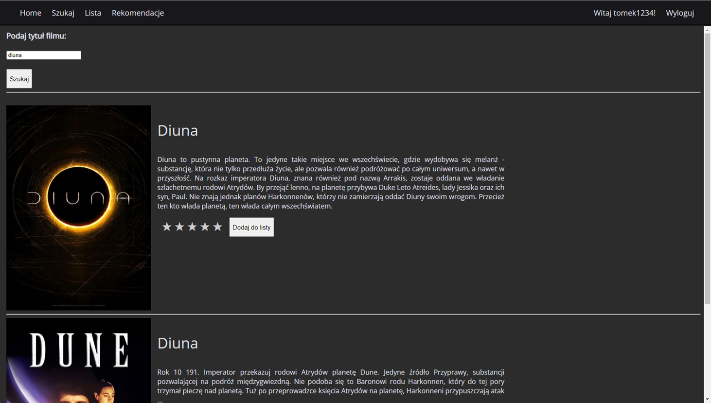
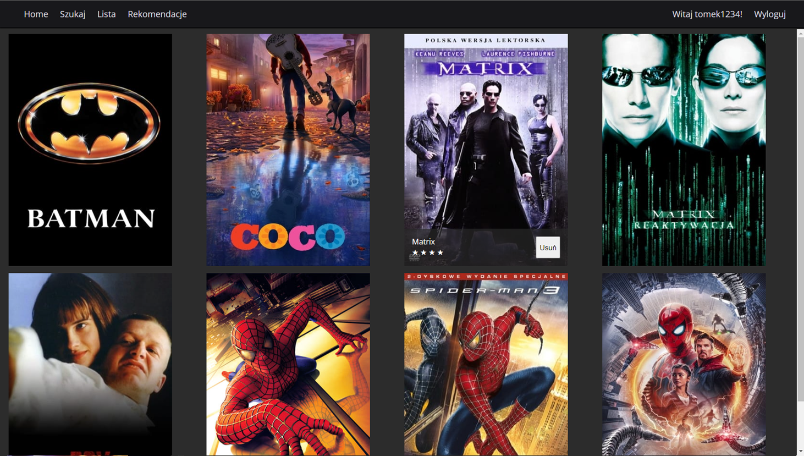
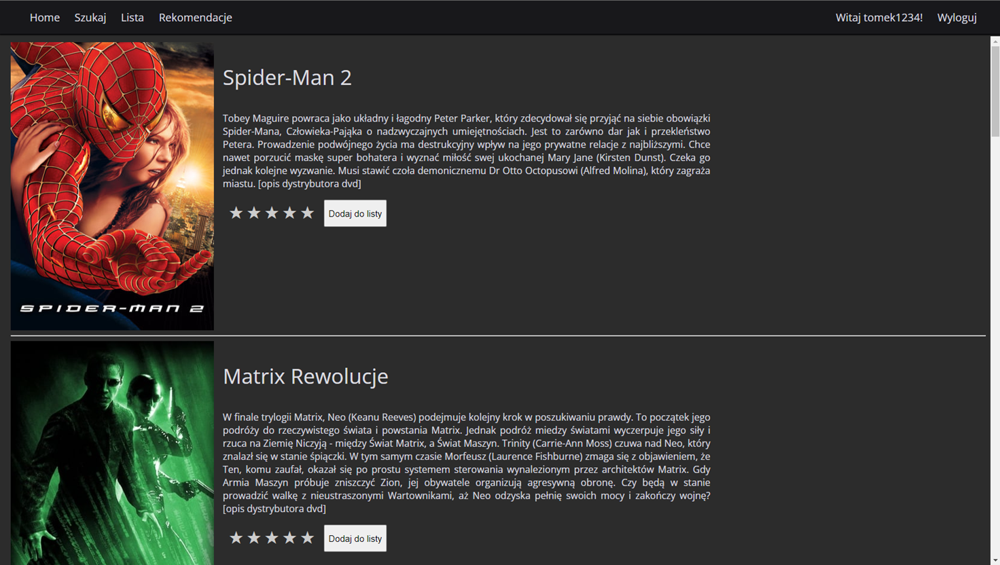

# Rekome

This is a web application created for my thesis and for learning Django, PostgreSQL, machine learning and other modern web technologies. The main functionality of the application is to allow the user to manage the list of movies and receive recommendations based on it.

## Features

* User registration and login
* Displaying a list of movie search results
* Displaying a list of watched movies with personal ratings
* Adding movies to the list
* Displaying a list of recommendations using kNN algorithm based on user's watched movies

## Screenshots

